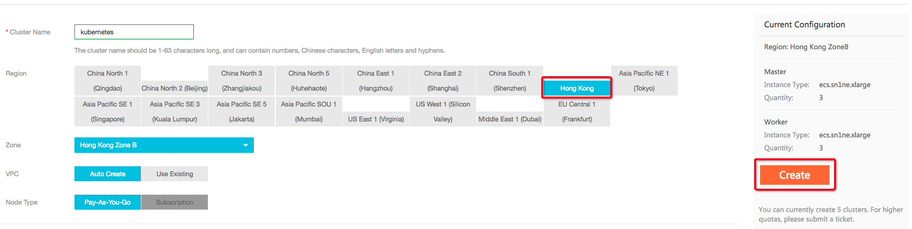

## How to Reproduce

### Login

Login to [Alibaba Cloud Container Service](https://cs.console.aliyun.com/) Website with your own alibaba cloud account.

### Create Kubernetes Cluster

Navigate to kubernetes cluster, Create a Hongkong Region(important) Kubernetes cluster.

>> Note:
>> pls select Hongkong region, because china mainland has some difficult on visiting
>> gcr.io/google-containers website for some certain reason.

### Deploy sonobuoy Conformance test

Once the configuration files have been created, you should be able to run `kubectl` to interact with the APIs of the Kubernetes cluster. Follow the conformance suite [instructions](https://github.com/cncf/k8s-conformance/blob/master/instructions.md#running) to test it.