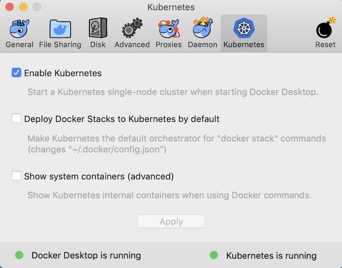

# Docker Desktop for Mac

Docker Desktop for Mac is an easy-to-install desktop app for building, debugging, and testing Dockerized apps on a Mac.

## Setup

- Download and install Docker Desktop for Mac version 2.0.1.0 (30090) Edge Channel: https://download.docker.com/mac/edge/30090/Docker.dmg
- In Docker Desktop for Mac preferences, enable Kubernetes to create a cluster on your local machine (see screenshot)



## Reproduce Conformance Tests

Download the last binary release of Sonobuoy

```
$ wget https://github.com/heptio/sonobuoy/releases/download/v0.13.0/sonobuoy_0.13.0_darwin_amd64.tar.gz
```

Run Sonobuoy on the cluster
```
$ sonobuoy run
```

Get the results on local
```
$ sonobuoy retrieve .
```

Clean up Kubernetes objects created by Sonobuoy
```
$ sonobuoy delete
```