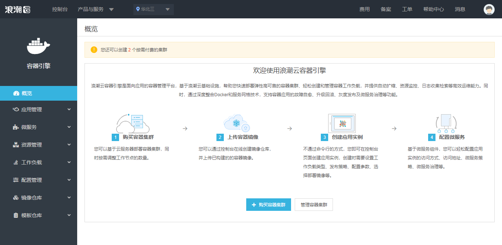

# Inspur Cloud Container Engine and Inpsur Open Platform

## Login or Create Account 

You'll first need to get started with Inspur Open Platform by setting up
an Inspur Cloud account if you don't have one before. For details, see the
[register](https://console1.cloud.inspur.com/document/account/1-registered.html)
instructions.

## Create a cluster

Then navigate to ICE, follow the [quick start](https://console1.cloud.inspur.com/document/cks/2-quickstart.html) instruction to create a kubernetes cluster using the UI.

## Run conformance tests

Wait for the cluster and all worker nodes to reach `running` state then follow the
[test instructions](https://github.com/cncf/k8s-conformance/blob/master/instructions.md#running)
to run the conformance tests.
