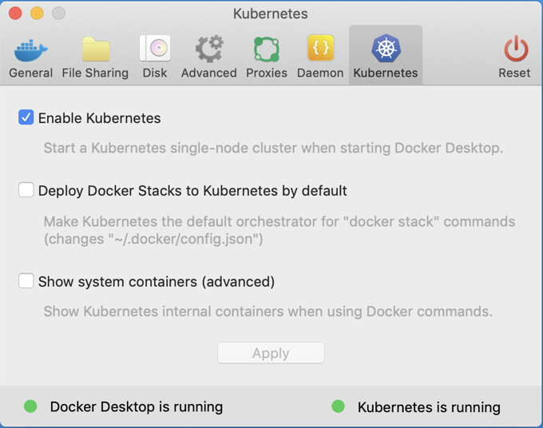

# Docker Desktop Enterprise for Mac

Docker Desktop Enterprise takes Docker Desktop Community, formerly known as Docker for Windows and Docker for Mac, a step further with simplified enterprise application development and maintenance.

## Setup

- Download and install Docker Desktop Enterprise for Mac version 2.0.0.2-ent (32735) Edge Channel: https://download.docker.com/mac/enterprise/Docker.pkg
- In Docker Desktop Enterprise for Mac preferences, enable Kubernetes to create a cluster on your local machine (see screenshot)



## Reproduce Conformance Tests

Download the last binary release of Sonobuoy

```
$ wget https://github.com/heptio/sonobuoy/releases/download/v0.14.0/sonobuoy_0.14.0_darwin_amd64.tar.gz
```

Run Sonobuoy on the cluster
```
$ sonobuoy run
```

Get the results on local
```
$ sonobuoy retrieve .
```

Clean up Kubernetes objects created by Sonobuoy
```
$ sonobuoy delete
```