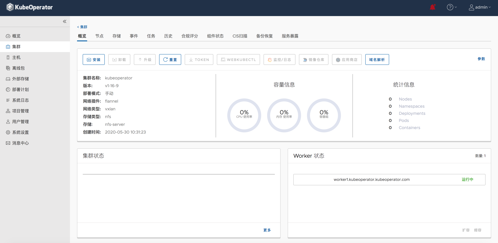

# Conformance tests for KubeOperator 2.6

## Install KubeOperator 2.6

Follow the [installation](https://docs.kubeoperator.io/KubeOperator-v2.6/installation) to install KubeOperator.

**Requirements**

OS requirements: CentOS 7.4 - 7.7 Minimal, RedHat 7.4 - 7.7 Minimal

**Download offline package**

URL: http://kubeoperator-1256577600.file.myqcloud.com/release/2.6/kubeOperator-v2.6.18-release.tar.gz

**Intall KubeOperator**
```bash
$ tar -zxvf kubeOperator-v2.6.18-release.tar.gz
```
```bash
$ cd kubeOperator-v2.6.18-release
```
```bash
$ ./kubeopsctl install
```
Wait until service running successfully.

## Prepare hosts for deploying Kubernetes

| Name            | Role    | Count  | OS             | Size       | Description  |
| --------------- | ------- | ------ | -------------- | ---------- | ---------------------------------------------------------------------- |
| master-1        | Master  | 1      | CentOS 7.6     | 4C 16G     | Running etcd、kube-apiserver、kube-scheduler、kube-apiserver.           |
| worker-1        | Worker  | 1      | CentOS 7.6     | 8C 32G     | Running kubelet、application workload.                                 |
| nfs-storage     | NFS     | 1      | CentOS 7.6     | 4C 16G     | Provide NFS persistent storage, disk recommendations of 500G or more. |

## Deploy Kubernetes

Deploy Kubernetes according to the [documentation](https://docs.kubeoperator.io/KubeOperator-v2.6/userguide-manual/).

### Step 1: Cluster Planning
1. System Settings
- Before using the KubeOperator, you must set the necessary parameters for the KubeOperator. These system parameters will affect the installation of the Kubernetes cluster and access to related services.
2. Prepare The Servers
- We will prepare to add three servers, one master and one worker. If NFS is used for persistent storage, we also need NFS storage server (for example, name nfs-1) to be used as master node, worker node and NFS storage respectively.
3. Prepare Storage
- In addition to KubeOperator support for automatically creating NFS storage and adding self-provisioning NFS storage, new support for cloud native storage solution Rook Ceph has been added.

### Strp 2: Cluster Deployment
1. Create Cluster
- After the project administrator account logs in to the KubeOperator system, click the "add" button on the "cluster" page to create the cluster.
2. Deploy Cluster
- Click on the cluster name to deploy in the cluster list, and by default the overview information for that cluster is displayed. The Kubernetes cluster is shown in great detail on the overview page. Click the install button at the top of the overview page to deploy the Kubernetes cluster.


## Run Conformance Test

1. Download a sonobuoy [binary release](https://github.com/vmware-tanzu/sonobuoy/releases) of the CLI, or build it yourself by running:
```bash
$ go get -u -v github.com/vmware-tanzu/sonobuoy
```

2. Run sonobuoy:
```bash
$ sonobuoy run --mode=certified-conformance
```

3. Watch the logs:
```bash
$ sonobuoy logs
```

4. Check the status:
```bash
$ sonobuoy status
```

5. Once the status shows the run as completed, you can download the results archive by running:
```bash
$ sonobuoy retrieve
```

Please refer to [sonobuoy.tar.gz](sonobuoy.tar.gz) for the result.