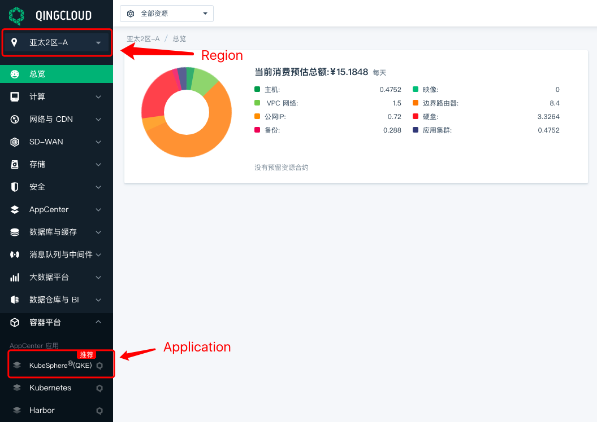
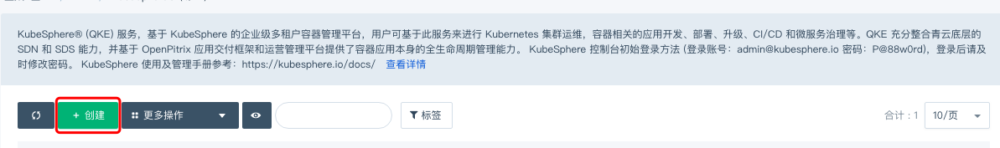
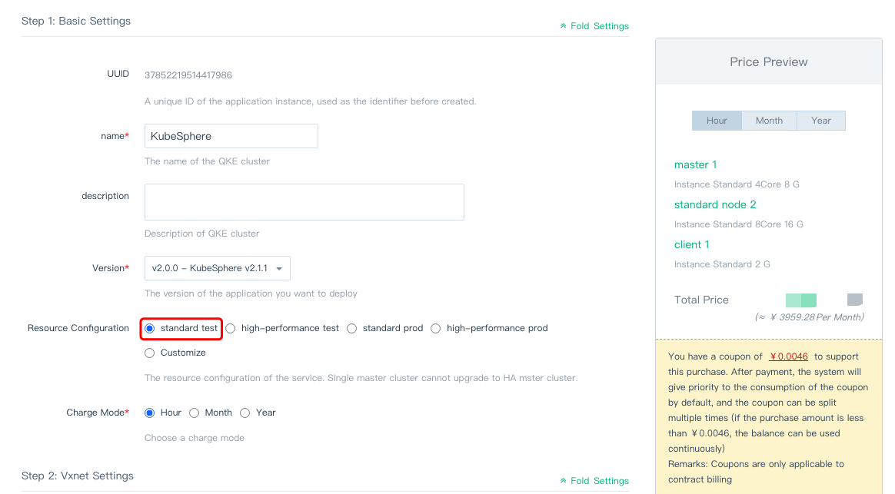
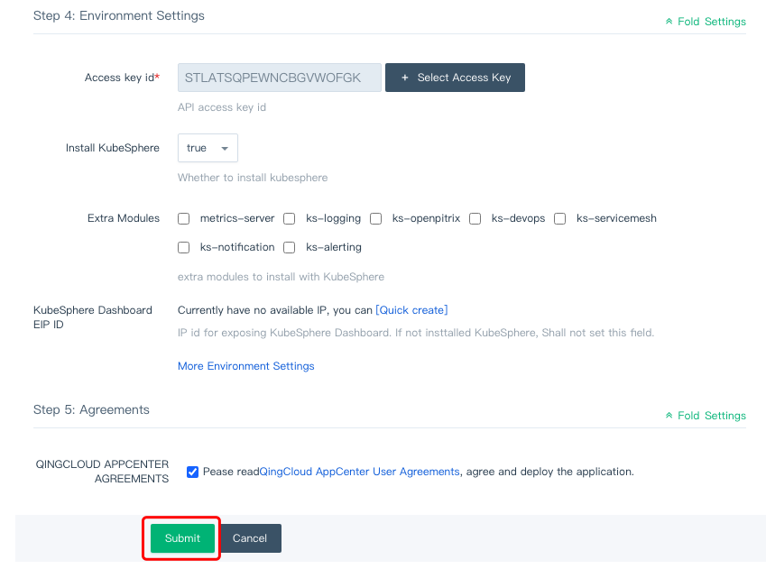
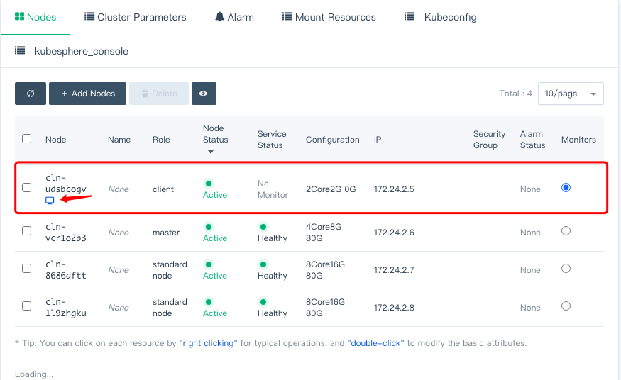
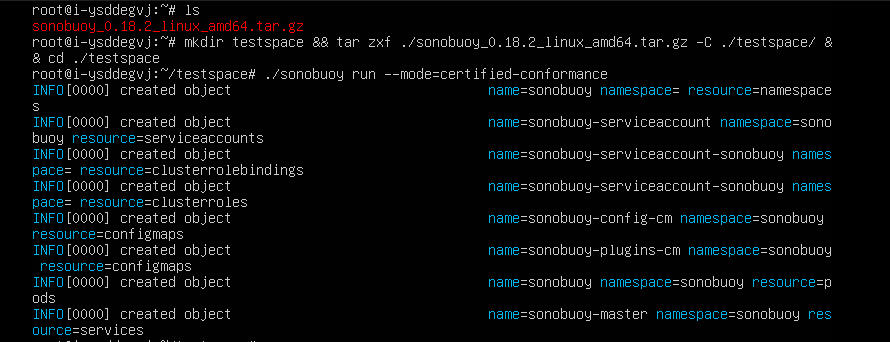

## How to Reproduce

### Login 

Sign in to [QingCloud Console](https://console.qingcloud.com/) with you own account.

### Create QKE Cluster

You can create QKE cluster according to [QKE User Guide](https://docs.qingcloud.com/product/container/qke/index).

- Choose ap2a/ap3 region, and navigate to QKE cluster



- Create Cluster with standard test resource configuration








- Choose client node as test host





>> Note:
>> please choose ap2a or ap3 region to avoid network issues when pulling gcr.io images.

### Run conformance tests

- Start the conformance tests on your test host

```shell
sonobuoy run \
  --mode=certified-conformance \
```

You can monitor the conformance tests by tracking the sonobuoy logs. Wait for the line no-exit was specified, sonobuoy is now blocking, which signals the end of the testing.

```shell
sonobuoy logs -f
```

Upon completion of the tests you can obtain the results by copying them off the sonobuoy pod.

```shell
OUTPUT_PATH=$(sonobuoy retrieve)
echo ${OUTPUT_PATH}
mkdir ./results
tar xzf ${OUTPUT_PATH} -C ./results
```
