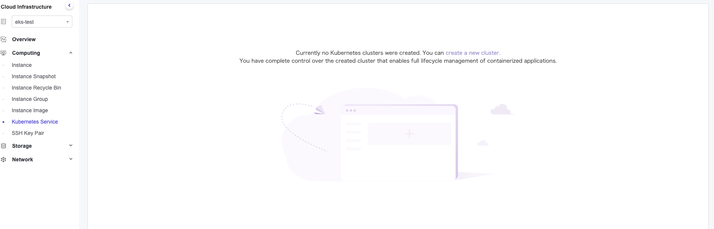
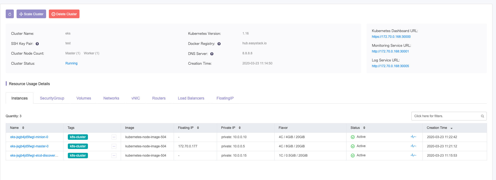

# EKS (EasyStack Kubernetes Service)
EasyStack Kubernetes Service (EKS) Enterprise container platform contains the best of bred capability of an integrated Kubernetes and OpenStack solutions. Capabilities such as orchestration, scheduling, security, operations and maintenance, including many other aspects of management to achieve integration of application and infrastructure resources, enable last mile of cloud data center next generation application delivery, amplifying the resulting equation where 1 + 1 > 2
## Running the k8s conformance tests
Login in ecs, choose Kubernetes Services and click create a new cluster.

Fill out the cluster configuration information and click Create button.

Wait for cluster creating completely.

SSH into k8s cluster via the ssh key pair.
You can then run the k8s conformance test by running the following command:

```console
$ go get -u -v github.com/vmware-tanzu/sonobuoy

$ sonobuoy run --mode=certified-conformance

$ sonobuoy retrieve ./results

# tar zxvf ./results/{XXX.tar.gz}
```
