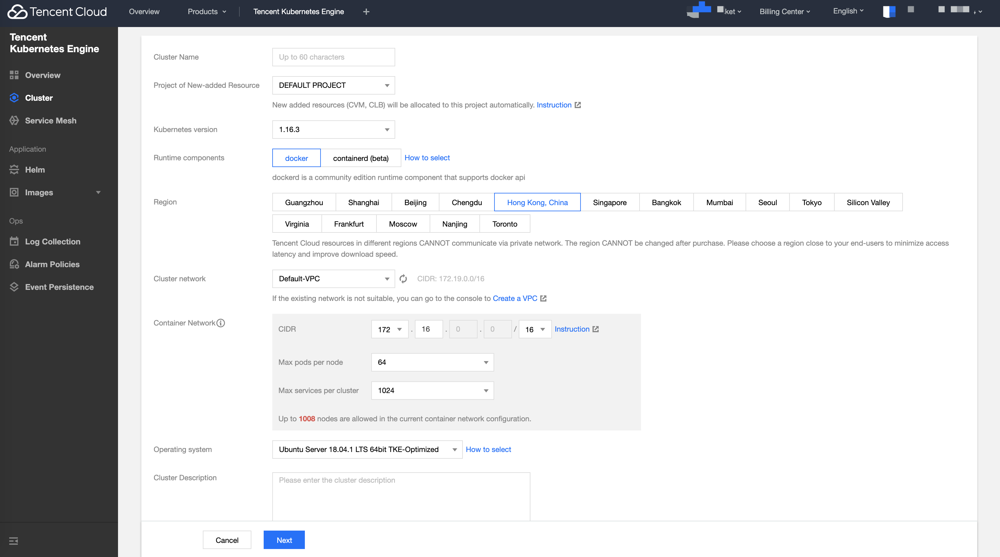

### Login Tencent Kubernetes Engine Console
- Follow the instructions to create a [Tencent Cloud Account](https://cloud.tencent.com/register)
- Go to  [Console of Tencent Kubernetes Engine ](https://console.cloud.tencent.com/tke2/cluster) 

### Create TKE Cluster
- Follow the instructions to create a [Create Cluster](https://intl.cloud.tencent.com/document/product/457/30637)
- The cluster region need choose out of China( e.g. Hong Kong)
- The cluster Kubernetes version need choose 1.16.3


### Deploy sonobuoy Conformance test
- After the creation completed, ssh to any node of cluster
- Run command as below

The standard tool for running these tests is Sonobuoy. Sonobuoy is regularly built and kept up to date to execute against all currently supported versions of kubernetes.
Download a binary release of the CLI, Refer to the following command to run：

```shell
sonobuoy run --mode=certified-conformance --kube-conformance-image-version=v1.16.3
```

See more in conformance suite [instructions](https://github.com/cncf/k8s-conformance/blob/master/instructions.md#running) to test it.