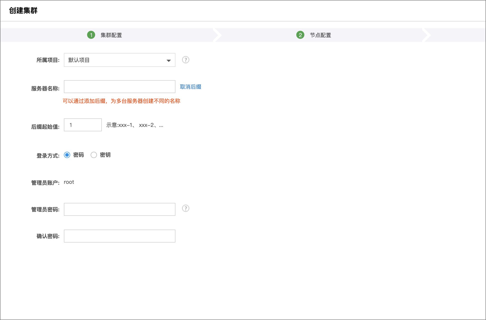

## How To Reproduce:


### Login
Login to [Kingsoft Cloud](https://passport.ksyun.com/) Website with your own kingsoft cloud account. If you don't have an account,please refer to the [page](https://passport.ksyun.com/register.html) to sign up an account first.

### Create Kubernetes Cluster
There are three steps to create a cluster:
1. Configure cluster information
2. Master And Worker Node configuration
3. Set basic information

Click the menu bar on the left side of the Ksyun Cloud console, select [Compute]-[Container Engine] to enter the console of the container engine

##### Configure cluster information


    1）Cluster Name：User-defined cluster name, 2-64 characters, supports Chinese, English, numbers, and special characters -,.!$^*()%#&+/:;<=>[]_`{|}~

    2）Kubernetes Support Version：The current Kingsoft Cloud kubernetes version is 1.10.5, 1.12.3, 1.13.4, 1.15.5, 1.17.6 and 1.18.3

    3）Cluster Network：Select the VPC network where the cluster is located

    4）Terminal Subnet：The terminal subnet is used to create private network load balancing and is used for communication between the master node and worker nodes in the cluster

    5）Pod CIDR：Assign the IP of this network address segment to the Pods in the cluster. The customer defines three private networks as Pod network segments

    6）Service CIDR：Assign the IP of this network address segment to the Service in the cluster. The customer defines three private networks as the Service segment

    7）Network Model：Select the network model of the cluster, currently supports Flannel and Canal

    8）Cluster Description：Cluster description, user-defined

##### Master And Worker Node configuration
User-defined configuration and network information of nodes in the cluster：

    1）Billing Model：For the time being, only the daily configuration payment (monthly settlement) and hourly configuration real-time payment are supported

    2）Master Management Mode：Currently only supports the independent deployment mode, the managed mode cluster is under internal testing, so stay tuned

    3）Node Type：Currently supports the selection of ordinary cloud hosts and dedicated cloud hosts to create clusters

    4）Security Group：Define the security group to which the nodes in the cluster belong. For the container cluster security group recommended settings, please refer to the container cluster security group recommended settings

###### Master&Etcd node selection


    1）Availability Zone: Select Availability Zone for Node Deployment

    2）Cluster network-subnet: Select the subnet information in the VPC deployed by the node

    3）Cloud Server Series: Customize cloud server series

    4）Cloud Server Type: Customize the type of cloud server

    5）CPU Configuration: Custom CPU configuration, recommended >=4 core

    6）Memory Configuration: Custom memory configuration, recommended >=8G

    7）Operating System: Currently, Kingsoft Cloud Container Engine only supports CentOS 7.5 64-bit and Ubuntu-18.04 64-bit node images

    8）System Disk: 本地SSD，20G

    9）Data Disk: Local SSD, custom data disk size


###### Worker node selection

Configuration information is the same as Master&Etcd

##### Set basic information


    1）Project: Cloud resources project

    2）Server Nickname: Custom server name, 2-64 characters, support Chinese, English, numbers, and special characters -,.!$^*()%#&+/:;<=>[]_`{|}~

    3）Login Method: User-defined choice of login method, support setting password and key login

Click the [Create] button to perform the operation of creating a cluster, you can query the created cluster on the cluster list page


##### Access to Cluster
Once you Kubernetes cluster is active, Download it's kubeconfig file on the cluster details page and save it locally.


### Run Conformance Test
1. Download a sonobuoy [binary release](https://github.com/heptio/sonobuoy/releases) of the CLI, or build it yourself by running:
    ```sh
    $ go get -u -v github.com/heptio/sonobuoy
    ```

1. Configure your kubeconfig file by running:
    ```sh
    $ export KUBECONFIG="/path/to/your/cluster/config"
    ```

3. Run sonobuoy:
    ```sh
    $ sonobuoy run
    ```

4. Watch the logs:
    ```sh
    $ sonobuoy logs
    ```

5. Check the status:
    ```sh
    $ sonobuoy status
    ```

6. Once the status commands shows the run as completed, you can download the results tar.gz file:
    ```sh
    $ sonobuoy retrieve
    ```