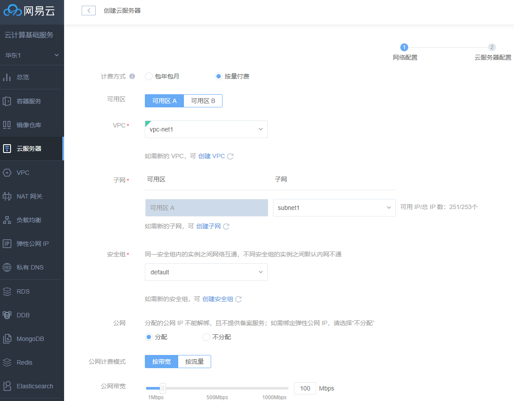
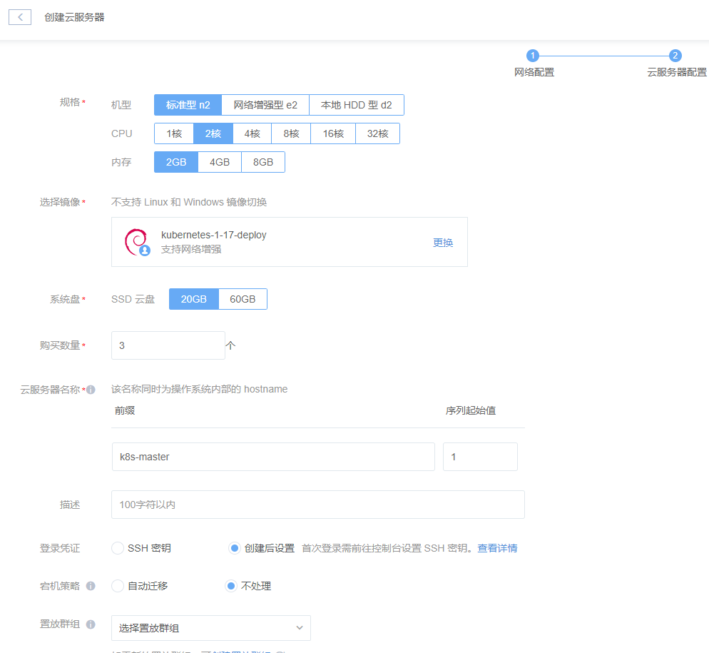

## How to Reproduce

### 1. Install an 'Netease Container Service Dedicated' kubernetes cluster based on steps below

 (1) Prepare virtual machines to deploy kuberntes cluster on netease cloud platform.

  a. Login [website of netease Cloud platform](https://c.163yun.com/dashboard#/nvm/list/index) with your own netease cloud account. navigate to the webpage where create virtual machines

  b. Create three virtual machines for k8s master node and one virtual machine for k8s worker node, each master node must has at least 2 CPUs and 2 GiB RAM, the operation guide as shown in the follow figures:



  Remember to choose the `kubernetes-1-17-deploy` image to create, so you can directly get these virtual machines who have default kuernetes images, binary files and other config files.

 (2) Login the first virtual machine of master node, then execute the command as root :

```
kubeadm init --config ~/kubeadm.conf
```

if run finished, you can see the words: "Your Kubernetes control-plane has initialized successfully!", please record all informantions below the words to use in the next two steps.

 (3) Login the last two virtual machines of master node, then execute the command as root respectively:

```
kubeadm join xxx:6443 --token yyy --discovery-token-ca-cert-hash sha256:zzz --control-plane --certificate-key kkk
```

 (4) Login the virtual machine of worker node, then execute the command as root:

```
kubeadm join xxx:6443 --token yyy --discovery-token-ca-cert-hash sha256:zzz
```

 (4) Deploy network plugin(eg: flannel), execute the command in any master machine: 
```
kubectl apply -f https://github.com/coreos/flannel/blob/master/Documentation/kube-flannel.yml
```

### 2. Launch the e2e conformance test with following the [instructions](https://github.com/cncf/k8s-conformance/blob/master/instructions.md#running)

**Note**: If you have trouble with pulling the images k8s-conformance related by reason of Firewall, just to find a server which located outside of China Mainland and make sure you can ssh login the server by public IP, then you can use ssh port-forward to access the repositories of google(such as k8s.gcr.io, quay.io), the steps of ssh port-forward as below: 
```
   1) execute command: ssh -Nf -D 127.0.0.1:4000 root@{the-public-ip}
   2) add "all_proxy=socks5://127.0.0.1:4000" environment to docker setup config 
   3) restart docker daemon service
```
