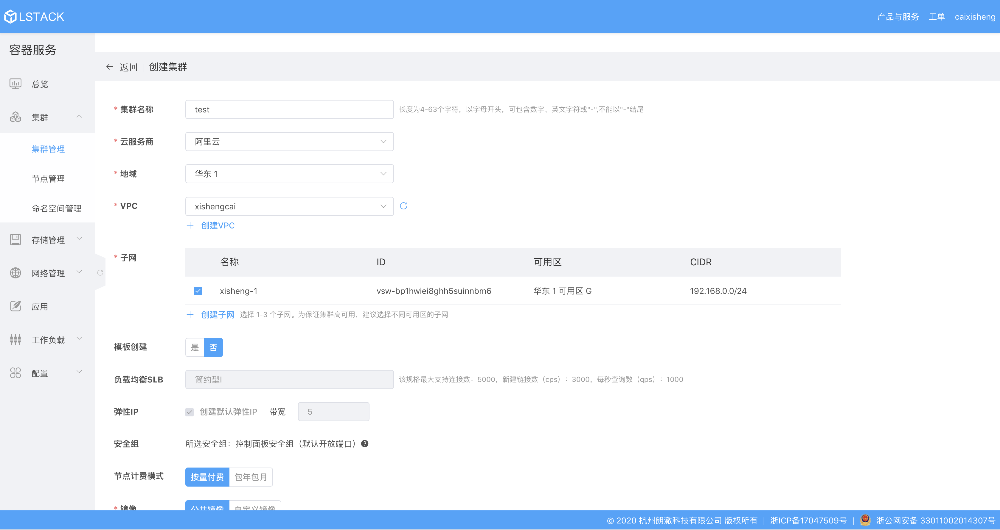

## How to Reproduce

### Login

Login to [LStack Container Service](https://www.lstack.com/cluster/cluster-adm/) Website with your own lstack cloud account.

### Create Kubernetes Cluster

Navigate to kubernetes cluster, Create a Hangzhou Region Kubernetes cluster with cloud provider alicloud.

>> Note:
>> you must have an account of cloud provider(like alicloud or huawei cloud).

### Deploy sonobuoy Conformance test

Once the configuration files have been created, you should be able to run `kubectl` to interact with the APIs of the Kubernetes cluster. Follow the conformance suite [instructions](https://github.com/cncf/k8s-conformance/blob/master/instructions.md#running) to test it.
