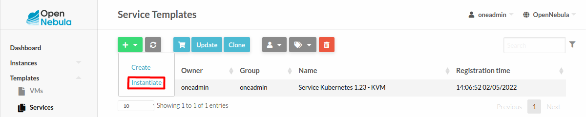
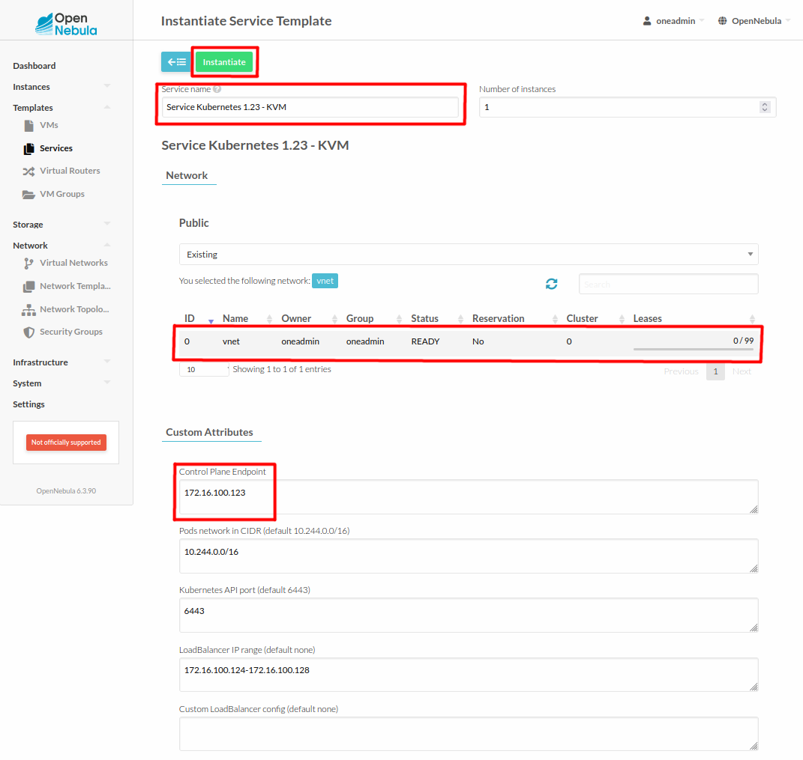

# OpenNebula - Kubernetes appliance

## Instructions for the deployment and verifying the conformance tests

### Setup a server node

We will need just one server node to verify the results. This node should be powerful enough to be able to run up to ten kubernetes nodes as virtual machines.

**NOTE**:
> You can run this node machine as VM itself if you configure the nested virtualization.

#### Recommended specification

- 20+ (v)CPU
- 32+ GB RAM
- 360+ GB disk space
- 1 NIC with an access to the internet and a default route
- Ubuntu 20.04 (or other OS supported by [minione](https://github.com/OpenNebula/minione#requirements))

#### OpenNebula installation

For our example we will go with **Ubuntu 20.04** and we set the hostname to `opennebula-server` - to distinguish commands run on the opennebula server from those run inside the appliance VMs.

The installation will be done via an easy-to-use OpenNebula's bash installer called [minione](https://github.com/OpenNebula/minione).

Firstly we have to install `wget`:

```
root@opennebula-server:~# apt -y install wget
```

and as the next step we download `minione`:

```
root@opennebula-server:~# wget 'https://github.com/OpenNebula/minione/releases/latest/download/minione'
```

Now we can install OpenNebula server - this will take a couple of minutes:

```
root@opennebula-server:~# bash minione --force --version 6.3.90 --yes --password k8s-test --marketapp-name 'Service Kubernetes 1.23 - KVM'
```

The installation (if successful) should at the end print out useful report like this:

```
### Report
OpenNebula 6.3.90 was installed
Sunstone is running on:
  http://10.80.19.129/
FireEdge is running on:
  http://10.80.19.129:2616/
Use following to login:
  user: oneadmin
  password: k8s-test
```

The previous command already downloaded the Kubernetes appliance from the OpenNebula marketplace and setup the oneadmin's password via which we can login into the web interface called Sunstone. For more information you can take a look at the [documentation](https://docs.opennebula.io/minione/simple/validation.html).

OpenNebula server node should be ready by now and so we can open the URL of the Sunstone in a browser: `http://opennebula-server`

Or verify the host with the `onehost` command:

```
root@opennebula-server:~# onehost list
  ID NAME                                 CLUSTER    TVM      ALLOCATED_CPU      ALLOCATED_MEM STAT
   0 localhost                            default      0      0 / 3200 (0%)    0K / 31.3G (0%) on
```

### Deploy the Kubernetes appliance

The `sonobuoy` conformance test suite requires at least 2-node kubernetes cluster. By default the Kubernetes appliance deploys 4 roles:

- vnf: 2 VMs that implement the load-balancer for the Control-Plane
- master: 3 VMs where master nodes are located (tainted with `node-role.kubernetes.io/master=true:NoSchedule`)
- worker: 2 VMs to act as regular worker nodes (can be scaled up if more nodes are required)
- storage: 3 VMs dedicated for Longhorn replicas (tainted with `node.longhorn.io/create-default-disk=true:NoSchedule`)

This setup satisfies the `sonobuoy` requirement with the caveat that both mentioned taints have to be treated as "non-blocking".

#### Deploy Kubernetes cluster

At this point the `Service Kubernetes 1.23 - KVM` appliance has already been downloaded into the OpenNebula instance along with VM templates and images:

```
root@opennebula-server:~# oneflow-template list
  ID USER     GROUP    NAME                                                                 REGTIME
   0 oneadmin oneadmin Service Kubernetes 1.23 - KVM                                 04/29 14:03:30
```
```
root@opennebula-server:~# onetemplate list
  ID USER     GROUP    NAME                                                                 REGTIME
   2 oneadmin oneadmin Service Kubernetes 1.23 - KVM-2                               04/29 14:03:30
   1 oneadmin oneadmin Service Kubernetes 1.23 - KVM-1                               04/29 14:03:30
   0 oneadmin oneadmin Service Kubernetes 1.23 - KVM-0                               04/29 14:03:30
```
```
root@opennebula-server:~# oneimage list
  ID USER     GROUP    NAME                                    DATASTORE     SIZE TYPE PER STAT RVMS
   3 oneadmin oneadmin Service Kubernetes 1.23 - KVM-2-1       default        60G OS    No rdy     0
   2 oneadmin oneadmin Service Kubernetes 1.23 - KVM-2-0       default        20G OS    No rdy     0
   1 oneadmin oneadmin Service Kubernetes 1.23 - KVM-1-0       default        20G OS    No rdy     0
   0 oneadmin oneadmin Service Kubernetes 1.23 - KVM-0         default         2G OS    No rdy     0
```

Everything is in the place to deploy the Kubernetes cluster based on the new service template `Service Kubernetes 1.23 - KVM`:

- Login into the `Sunstone UI` using `oneadmin/k8s-test` credentials.

- Navigate to **Templates -> Services** on the left menu panel.

- Find the `Service Kubernetes 1.23 - KVM`, then press the `+` button and pick `Instantiate` from the list.
  

- Provide parameters: `Service name`, select the only existing network `vnet`, IPv4 address for the `Control Plane Endpoint` (should be taken from the `vnet`'s subnet, for example `172.16.100.123`), optionally you can provide a range for the MetalLB load-balancer (for example `172.16.100.124-172.16.100.128`).
  

- Press the `Instantiate` button to deploy the service.

This will take another couple of minutes before all the nodes are up and ready - we can check the status with this command:

```
root@opennebula-server:~# oneflow list
  ID USER     GROUP    NAME                                  STARTTIME STAT
  10 oneadmin oneadmin Service Kubernetes 1.23 - KVM    04/29 15:55:35 RUNNING
```

When the column `STAT` is showing `RUNNING` we can try to ssh login into the master kubernetes node.

To find the name of the first master node we can execute:

```
root@opennebula-server:~# oneflow show 'Service Kubernetes 1.23 - KVM' --json | jq -r '.DOCUMENT.TEMPLATE.BODY.roles[]|select(.name=="master").nodes[0].vm_info.VM.NAME'
master_0_(service_1)
```

To obtain the IPv4 address of the first master node we can execute:

```
root@opennebula-server:~# onevm show 'master_0_(service_1)' --json | jq -r '.VM.TEMPLATE.NIC[0].IP'
172.16.100.4
```

To download the `admin.conf` file:

```
root@opennebula-server:~# install -d ~/.kube/ && scp root@172.16.100.4:/etc/kubernetes/admin.conf ~/.kube/config
Warning: Permanently added '172.16.100.4' (ECDSA) to the list of known hosts.
admin.conf                                        100% 5642     9.4MB/s   00:00
```

#### Run conformance tests

Let's start with checking if `kubectl` works:

```
root@opennebula-server:~# kubectl get nodes -o wide
NAME                       STATUS   ROLES                  AGE   VERSION   INTERNAL-IP     EXTERNAL-IP   OS-IMAGE             KERNEL-VERSION      CONTAINER-RUNTIME
onekube-ip-172-16-100-10   Ready    <none>                 27m   v1.23.6   172.16.100.10   <none>        Ubuntu 20.04.4 LTS   5.4.0-109-generic   docker://20.10.14
onekube-ip-172-16-100-11   Ready    <none>                 27m   v1.23.6   172.16.100.11   <none>        Ubuntu 20.04.4 LTS   5.4.0-109-generic   docker://20.10.14
onekube-ip-172-16-100-4    Ready    control-plane,master   29m   v1.23.6   172.16.100.4    <none>        Ubuntu 20.04.4 LTS   5.4.0-109-generic   docker://20.10.14
onekube-ip-172-16-100-5    Ready    control-plane,master   29m   v1.23.6   172.16.100.5    <none>        Ubuntu 20.04.4 LTS   5.4.0-109-generic   docker://20.10.14
onekube-ip-172-16-100-6    Ready    control-plane,master   29m   v1.23.6   172.16.100.6    <none>        Ubuntu 20.04.4 LTS   5.4.0-109-generic   docker://20.10.14
onekube-ip-172-16-100-7    Ready    <none>                 28m   v1.23.6   172.16.100.7    <none>        Ubuntu 20.04.4 LTS   5.4.0-109-generic   docker://20.10.14
onekube-ip-172-16-100-8    Ready    <none>                 27m   v1.23.6   172.16.100.8    <none>        Ubuntu 20.04.4 LTS   5.4.0-109-generic   docker://20.10.14
onekube-ip-172-16-100-9    Ready    <none>                 27m   v1.23.6   172.16.100.9    <none>        Ubuntu 20.04.4 LTS   5.4.0-109-generic   docker://20.10.14
```

The rest of this document is following the instructions of the `sonobuoy` test suite found here: https://github.com/cncf/k8s-conformance/blob/master/instructions.md

1. Download **sonobuoy**:

    ```
    root@opennebula-server:~# curl -fssLO https://github.com/vmware-tanzu/sonobuoy/releases/download/v0.56.4/sonobuoy_0.56.4_linux_amd64.tar.gz
    ```

1. Extract `sonobuoy` tool from the archive:

    ```
    root@opennebula-server:~# tar -xf sonobuoy_0.56.4_linux_amd64.tar.gz sonobuoy
    ```

1. Run tests:

    ```
    root@opennebula-server:~# ./sonobuoy run --mode=certified-conformance --plugin-env=e2e.E2E_EXTRA_ARGS='--non-blocking-taints=node-role.kubernetes.io/master,node.longhorn.io/create-default-disk'
    INFO[0000] create request issued                         name=sonobuoy namespace= resource=namespaces
    INFO[0000] create request issued                         name=sonobuoy-serviceaccount namespace=sonobuoy resource=serviceaccounts
    INFO[0000] create request issued                         name=sonobuoy-serviceaccount-sonobuoy namespace= resource=clusterrolebindings
    INFO[0000] create request issued                         name=sonobuoy-serviceaccount-sonobuoy namespace= resource=clusterroles
    INFO[0000] create request issued                         name=sonobuoy-config-cm namespace=sonobuoy resource=configmaps
    INFO[0000] create request issued                         name=sonobuoy-plugins-cm namespace=sonobuoy resource=configmaps
    INFO[0000] create request issued                         name=sonobuoy namespace=sonobuoy resource=pods
    INFO[0000] create request issued                         name=sonobuoy-aggregator namespace=sonobuoy resource=services
    ```

This may take an hour or two to finish - you can monitor the progress with the command:

```
root@opennebula-server:~# ./sonobuoy status
         PLUGIN     STATUS   RESULT   COUNT   PROGRESS
            e2e    running                1
   systemd-logs   complete                8

Sonobuoy is still running. Runs can take 60 minutes or more depending on cluster and plugin configuration.
```

When test suite is finished the former command will give an output similar to this:

```
root@opennebula-server:~# ./sonobuoy status
         PLUGIN     STATUS   RESULT   COUNT   PROGRESS
            e2e   complete   passed       1
   systemd-logs   complete   passed       8

Sonobuoy has completed. Use `sonobuoy retrieve` to get results.
```

We will do as is hinted:

```
root@opennebula-server:~# outfile=$(./sonobuoy retrieve)
root@opennebula-server:~# cp -a "$outfile" sonobuoy.tar.gz
```

Content of the test is in the exported archive `sonobuoy.tar.gz`.
