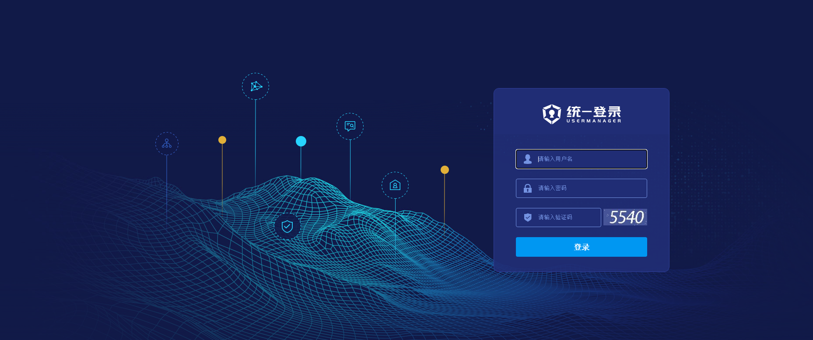
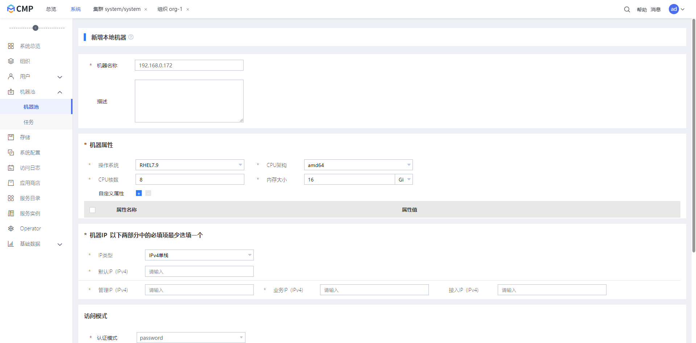
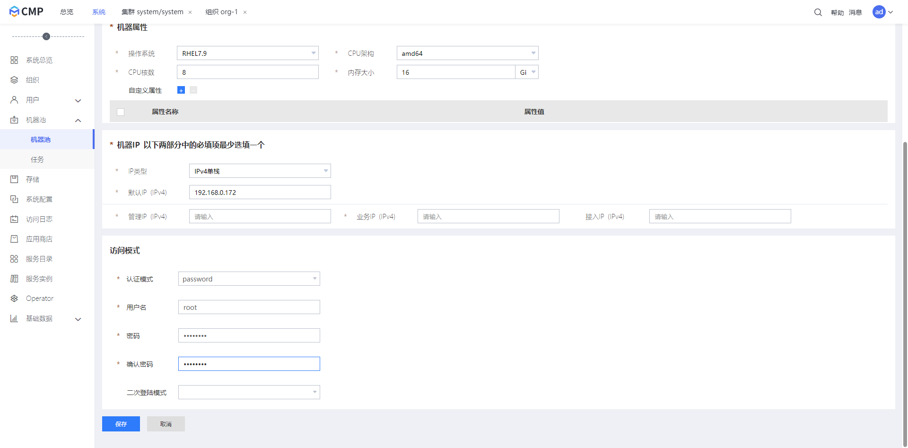
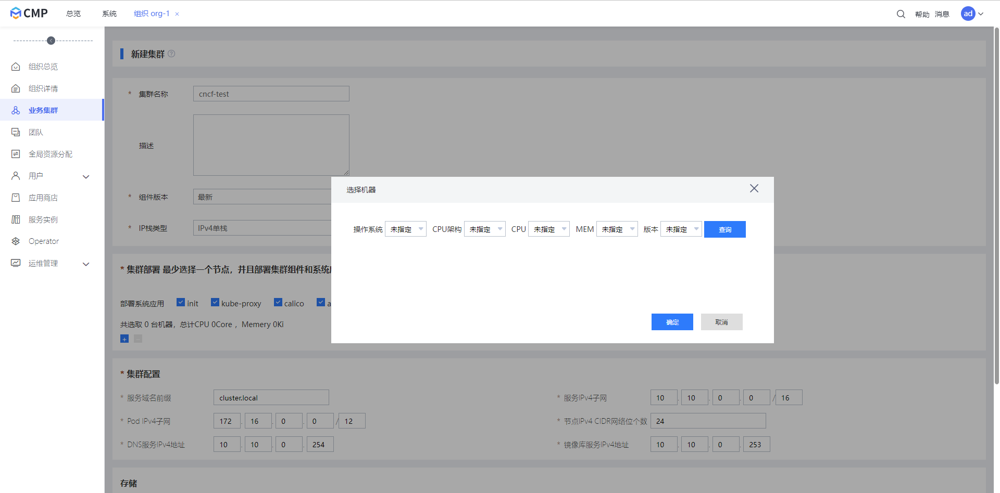
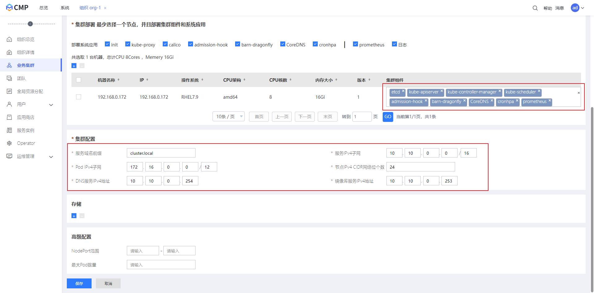
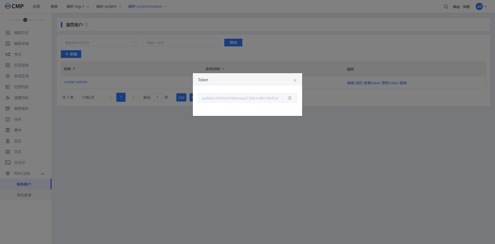

# Install CloudLink-CMP

## Download The Package

```shell
$ wget https://resource.bessystem.com/download/Phoenix/Media/4.2.0/CLOUDLINK-CMP-4.2.0-X86_64.bin
```

## Unpack Package:

```shell
$ chmod +x CLOUDLINK-CMP-4.2.0-X86_64.bin
$ ./CLOUDLINK-CMP-4.2.0-X86_64.bin
```

## Config The Install Option

```shell
$ vi install/supports/global.config
$ vi install/supports/machines.yaml
```

## Start Install

```shell
$ ./install/bin/install.sh
```

## Wait Install Done

The script will automatically exit after the installation is complete.

# Create Cluster

## login

Sign into CloudLink-CMP Console with you own account.



## Add Machines


setting machine info



save machine info



## Init Machine


## Create kubernetes cluster

Setting cluster name, select machines, and setting configs.



choose kubernetes components install node（The host of api-server will be determined according to your choice）



## Create Access Token

create ClusterRole of admin


create serviceaccount


authorize serviceaccount


get token



config kubeconfig on machine by token


# Run conformance tests
Start the conformance tests on your test host

```

$ sonobuoy run --mode=certified-conformance --dns-pod-labels k8s-app=core-dns

```
Check the status:
```
$ sonobuoy status
```

Once the status commands shows the run as completed, you can download the results tar.gz file:

```
$ sonobuoy retrieve
```
