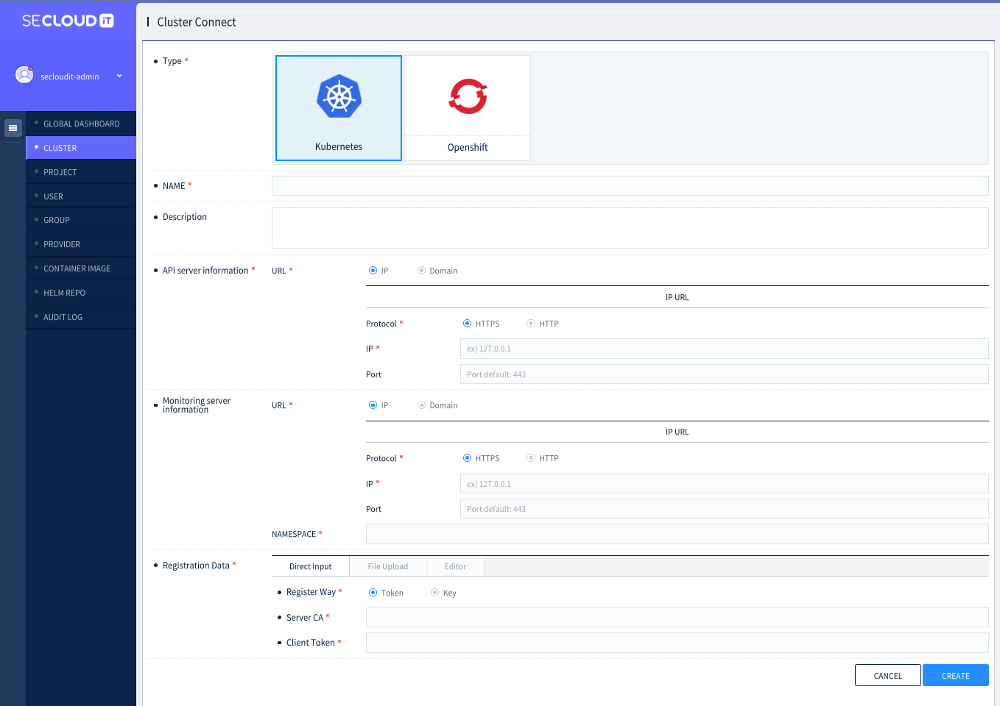

# Instruction for conformance test of SECloudit

## Setup the Kubernetes cluster
Kubernetes cluster should be prepared for conformance test.
- At least 1 control node and 2 worker node is required for SECloudit conformance test.
- Conformance test results won't be affected by the type of computing machine, but for this test, we used OpenStack virtual machine. 
- Similarly, any Linux-based operating system which is compatible with Kubernetes will work, but for this test, we have installed Kubernetes on Ubuntu 20.04.5 LTS.  

1. Install kubelet, kubeadm, kubectl on every Kubernetes node
```bash
sudo apt-get install -y kubelet=1.27.1-00 kubeadm=1.27.1-00 kubectl=1.27.1-00
```

2. Control node configuration
```bash
sudo kubeadm init --apiserver-cert-extra-sans=<CONTROL_NODE_IP> --control-plane-endpoint=<CONTROL_NODE_IP:PORT>
```

3. Worker node configuration
```bash
<kubeadm join command provided by step 2>
```

4. Install Calico
``` bash
curl https://raw.githubusercontent.com/projectcalico/calico/v3.25.1/manifests/calico.yaml -O

kubectl apply -f calico.yaml
```

## Register Kubernetes cluster on SECloudit
 - To make SECloudit available to manage the Kubernetes cluster, the user should register the cluster to SECloudit.
 - SECloudit will be installed by the vendor for licensed users.
 1. Login SECloudit
 - Login SECloudit with the administrative account.  
 

 2. Register cluster
  - By providing the required information, registering the cluster to SECloudit starts.
  - After the registration process is successfully completed, SECloudit is ready to manage the cluster.  
  

  ## Run conformance tests
1. Get Sonobuoy
```bash
wget https://github.com/vmware-tanzu/sonobuoy/releases/download/v0.56.16/sonobuoy_0.56.16_linux_amd64.tar.gz

tar -xzvf sonobuoy_0.56.16_linux_amd64.tar.gz
```

2. Run conformance tests
```bash
./sonobuoy run --plugin-env=e2e.E2E_EXTRA_ARGS="--ginkgo.v" --mode=certified-conformance
```

3. Check the Sonobuoy test status and wait for test complete
```bash
./sonobuoy status
```

4. Retrieve Sonobuoy test results
```bash
./sonobuoy retrieve
```