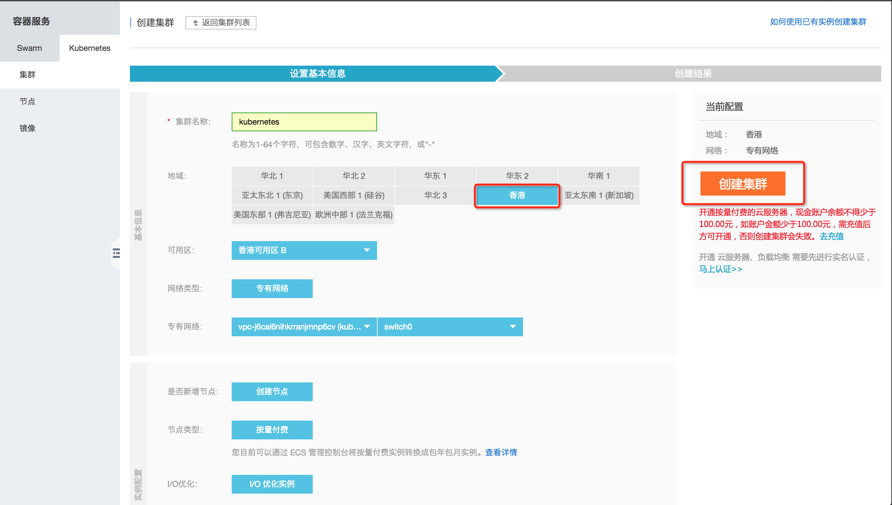

## How to Reproduce

### Login

Login to [Alibaba Cloud Container Service](https://cs.console.aliyun.com/) Website with your own alibaba cloud account.

### Create Kubernetes Cluster

Navigate to kubernetes cluster, Create a Hongkong Region(important) Kubernetes cluster.



>> Note:
>> pls select Hongkong region, because china mainland has some difficult on visiting
>> gcr.io/google-containers website for some certain reason.

### Deploy sonobuoy Conformance test

Select your newly created kubernetes cluster, click [dashboard] to dashboard page. Click [create],chose [from yaml]
Then paste yaml content(from [github](https://raw.githubusercontent.com/cncf/k8s-conformance/master/sonobuoy-conformance-1.7.yaml)) into box below.
and change ```"timeoutseconds": 3600``` to ```"timeoutseconds": 7200```
click create.

Navigate to your newly created sonobuoy deployment, view logs , wait for ```no-exit was specified, sonobuoy is now blocking``` line.

### View Result

EXEC into sonobuoy/sonobuoy POD from dashboard, ```cd /tmp/sonobuoy/``` to see the e2e.log results.

### Destroy Cluster

Navigate to Cluster management , click delete cluster.